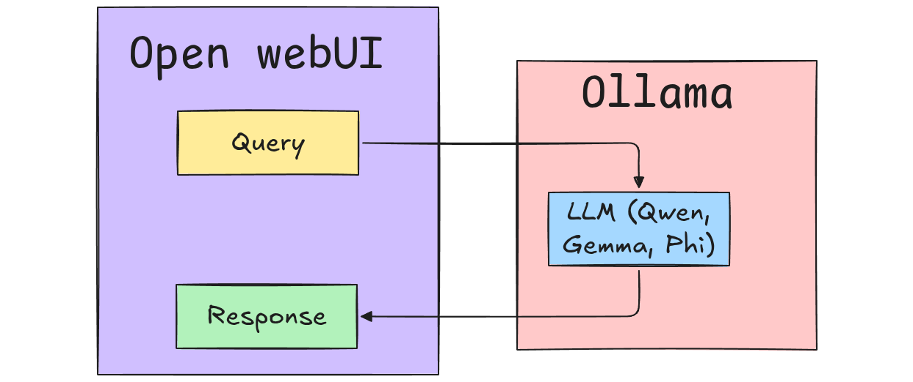
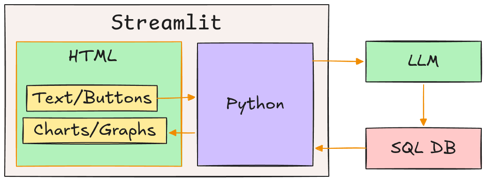
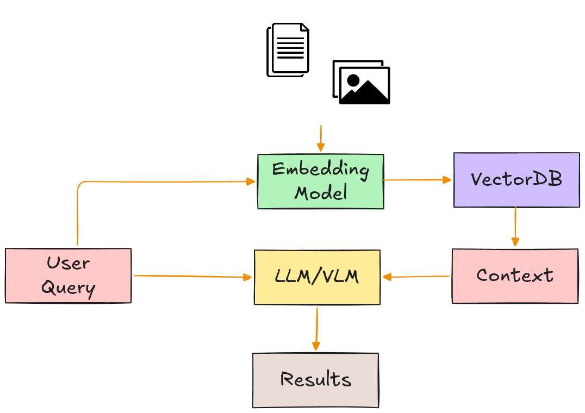
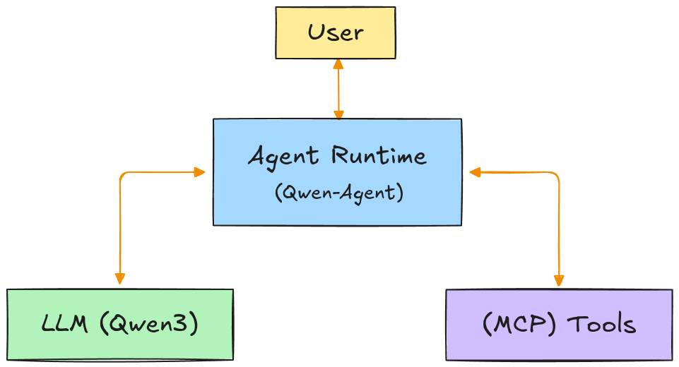

# Welcome to the "AI App Builders" Program!

## About This Course

August 2026 Holiday Program for Strathmore School students. A course on building **self-hosted** and **edge** AI apps for typical AI paradigms (e.g. Multimodal, RAG, tool use, AI agents, Text-to-SQL) using opensource AI components and stacks.

**This program subscribes to:**

- **Low-code setups**
  
  Given the limited time window, and the diverse technical background of the audience, we restrict coding in Python to a minimum. Nevertheless, our case studies are structured such that they can be easily extended by those with more advanced Python skills.
  
- **Modern AI Paradigms**
  
  Our case studies are guided by practical AI paradigms such as _Retrieval Augmented-Generation (RAG)_, Multimodality, Tool Calling, AI agents, _Model Context Protocol (MCP)_, and Text-to-SQL
  
- **Open-Source, Open-Weights, and DIY Setups**
  
  We emphasize AI components and stacks that are publicly available for download and self-hosting:
  
  - Data Privacy first
  - No API billing
  - No Credit cards
  - No Rate limits
  - No Vendor lock-in

## 🗓️ Day 1: AI Application Foundations

### A) Tasks

- We setup and explore the following basic AI Application Workflow

  

### B) Activities

  * Chat
  * _Visual Question Answering (VQA)_
  * Document _Retrieval Augmented-Generation (RAG)_
  * Model switching for performance comparison and multimodality

### C) Google Colab Notebook

- [**Aug2026 -- Day 1 -- AI Application Foundations.ipynb**](https://colab.research.google.com/drive/112DSm11HmI3j-Ousy5XHJ-vXQUvWiOah)
  
### D) Outcome

- _"I understand the essential components and structure of a DIY AI application."_
	
## 🗓️ Day 2: Building a Custom AI App (Connecting AI to Software)

### A) Task

- We combine our AI backend (_Ollama_ + _LLM_) with a _Streamlit-based_ frontend for a diversified UI
	
  

### B) Activities
	
* Text-to-SQL
* Data analysis and Visualization of AI output (Charts, Graphs)

### C) Google Colab Notebook

- [**Aug2026 -- Day 2 -- Building a Custom AI App.ipynb**](https://colab.research.google.com/drive/1282oV3I0y7MJoC5g0uhpVZuHcbFNeIbV)

### D) Outcome

- _"I can build a custom frontend to extend app usability"_

## 🗓️ Day 3: RAG Pipelines (Connecting AI to Knowledge)

### A) Tasks
- We explore and construct RAG pipelines for documents and images
	
	

### B) Activities
- Summarize PDFs, Markdown, etc docs
- Perform cross-modal semantic search and querying on private image collection

### C) Google Colab Notebook

- [**Aug2026 -- Day 3 -- RAG Pipelines.ipynb**](https://colab.research.google.com/drive/1lovtOi-YHYqpTAolaFedJIygIGlErUfa)
  
### D) Outcome
- _"I can build AI apps that can retrieve and analyze **privately** stored information."_

## 🗓️ Day 4: AI Agents (Connecting AI to Systems)

### A) Task

- We employ [Qwen-Agent](https://github.com/QwenLM/Qwen-Agent) for a fully edge AI solution capable of tool use, function calling, and MCP
  
  

### B) Activities
- Implement tools
  * Calculator tool
  * Weather tool
  * Database tool
  * Web search tool

### C) Google Colab Notebook

- [**Aug2026 -- Day 4 -- AI Agents.ipynb**](https://colab.research.google.com/drive/112DSm11HmI3j-Ousy5XHJ-vXQUvWiOah)
  
  
### D) Outcome
- _"I can automate how AI takes actions."_

<!--
Notice this is not yet CrewAI territory.

No need for:

```text
Planner Agent
Research Agent
Writer Agent
Critic Agent
```
-->

## 🗓️ Day 5: Capstone Projects

### A) School Sports Activity Planner

- Given a list of sports activities (by a student), the AI agent should be able to recommend a schedule for the week/month based on time of day, weather forecast, facility maintanance schedules, School calender, National calender, etc
    
### B) Fully-Edge Photo Album Assistant

- A **privacy first** and **offline** AI assistant capable of indexing a user's private collection of photos and retrieving them according to cross-modal queries (i.e. text prompts or image semantic searches)

