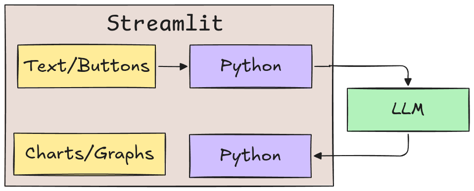
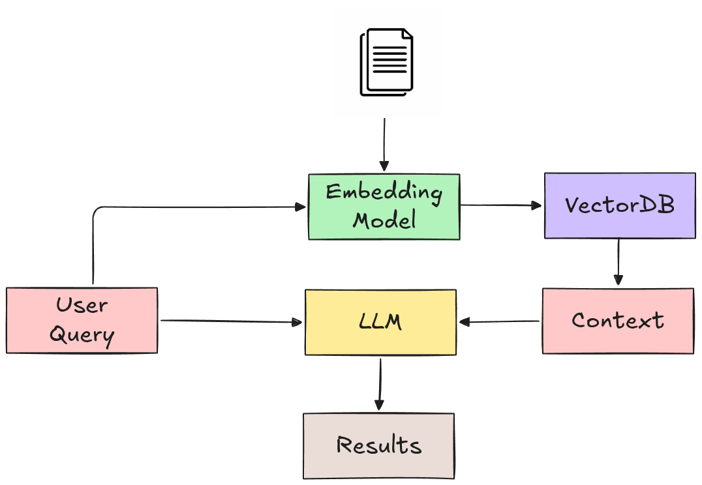
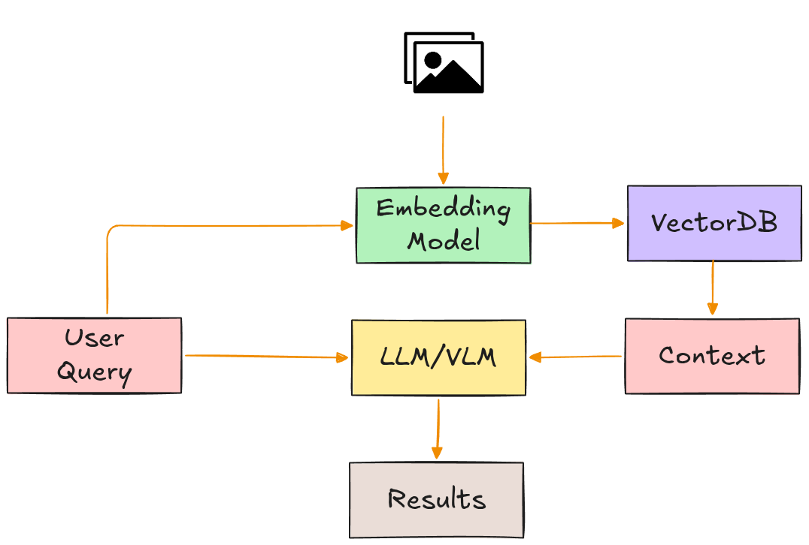
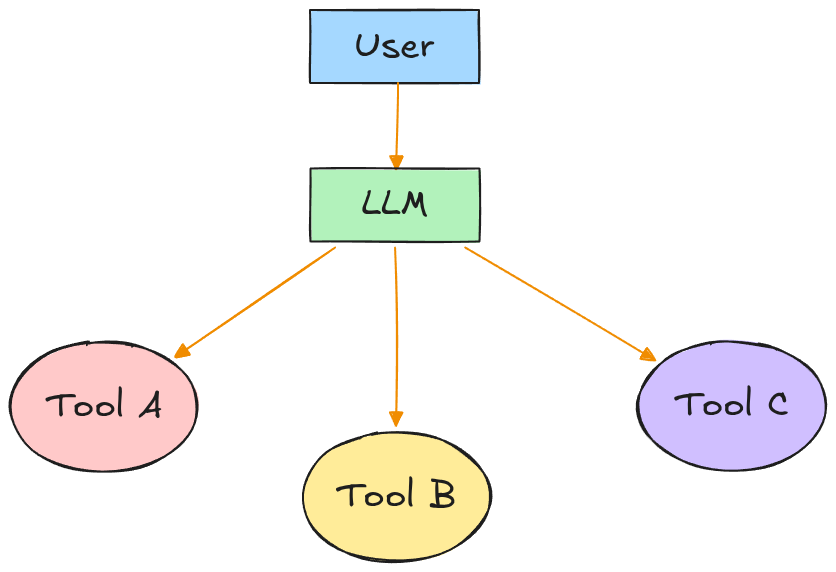

# Welcome to the AI App Builders Program!

## 🗓️ Day 1: AI Application Foundations (Using AI)

### A) Tasks

- Setup and explore the following basic AI Application Workflow

  

### B) Activities

  * Chat
  * _Visual Question Answering (VQA)_
  * Document _Retrieval Augmented-Generation (RAG)_
  * Model switching for performance comparison and multimodality

### C) Outcome

- _"I understand the essential components and structure of a DIY AI application."_
	
## 🗓️ Day 2: Building a Custom AI App (Connecting AI to Software)

### A) Task

- Combine your AI backend (_Ollama_ + _LLM_) with a _Streamlit-based_ frontend for a richer UI
	
  

### B) Activities
	
* Text-to-SQL
* Data analysis and Visualization of AI output (Charts, Graphs)
	
### C) Outcome

- _"I can build a custom frontend to extend app usability"_

## 🗓️ Day 3: RAG Pipelines (Connecting AI to Knowledge)

### A) Tasks
- Understand and construct RAG pipelines for documents and images using _Dify_ workflows
	  
	- **Document RAG**
	
	  
	
	- **Image RAG**
	
	  

### B) Activities
- Summarize PDFs, Markdown, etc docs
- Perform semantic search and querying on private image collection
  
### C) Outcome
- _"I can build multimodal AI apps that can retrieve and analyze **privately** stored information."_

## 🗓️ Day 4: Tool Calling and AI Agents (Connecting AI to Systems)

### A) Task

- Implement Dify workflows for tool use and simple AI agents
  
  

### B) Activities
- Implement tools
  * Calculator tool
  * Weather tool
  * Database tool
  * Web search tool

- Tool calling and agent loops

  ```text
  Question
    ↓
  Agent
    ↓
  Choose Tool
    ↓
  Answer
  ```

### C) Outcome
- _"I can automate how AI takes actions."_

<!--
Notice this is not yet CrewAI territory.

No need for:

```text
Planner Agent
Research Agent
Writer Agent
Critic Agent
```
-->

## 🗓️ Day 5: Capstone Projects

### Activity Planner

- Assumptions
  - Weather Forecast for the month
  - School academic and sports calender with major events
  - Open/Close times for fields, swimming pool, gym
  - Maintanance schedules (e.g. swimming pool, fields, gym)
- Based on total activity time required (for the month), and the factors above, the agent should be able to provide schedule for the activity and even suggest alternatives
  
### AI-Powered Photo Ablum Manager
- Auto update of knowledge base upon add/remove of images
- Visual and image description search modes
- structured retriveal modes e.g. based on dates/period, size, type (jpg, png), etc
- Cool UI

